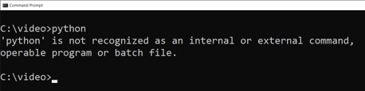
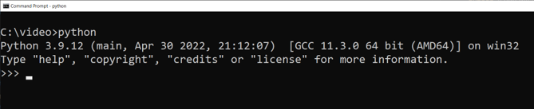
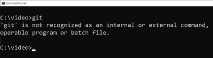
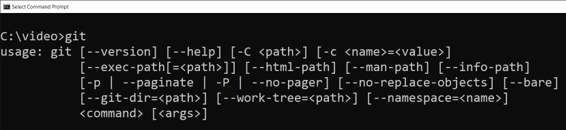
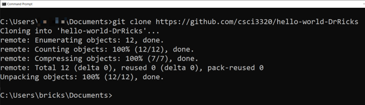
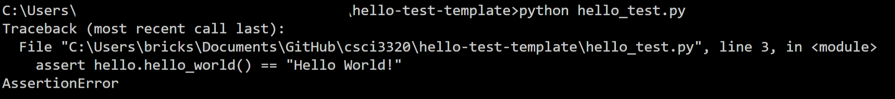
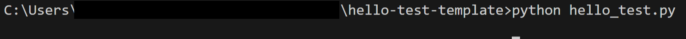
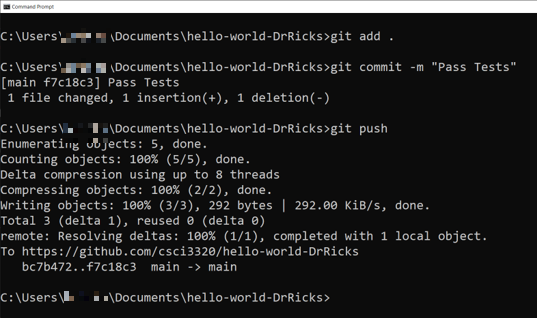
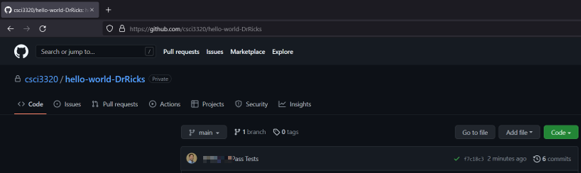
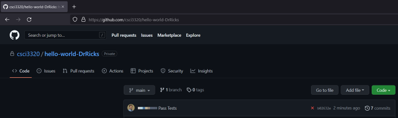

# Python + GitHub test.

This code will run, but it won't pass the test(s). Update hello.py so the tests run successfully.

# Running Tests

Passing this assignment requires you to follow these steps:

1. Install python.
2. Install git.
3. Clone the code from GitHub.
4. Do the coding assignment.
5. Run the tests.
6. Push your code to GitHub.
7. Check that your code passed according to GitHum

# Note about operating Systems

This tutorial is designed for Windows OS. The step on MacOS are almost identical, except that on recent versions, ``python`` should be repalced with ``python3``.

# Install Python

Before installing python, make sure that it isn't already installed. To check, open a terminal, command prompt, or Power Shell and type ```python```. If you get a message about python not being found, you need to install python.

For example, on Windows, if python is not installed, you would see the following on the terminal:



If python is installed, you would see the following on the terminal:



(Quick tip: to get out of the python interactive console, type ```quit()```)

To install python, go to https://www.python.org/downloads/ and get the installer that matches your operating system. After it is installed, you should see the above result when you type ```python```.


# Install git

Before installing git, make sure that it isn't already installed. To check, open a terminal, etc., and type ```git```. If you get a message about git not being found, you need to install git.

For example, on Windows, if git is not installed, you would see the following on the terminal:



If git is installed, you would see the following on the terminal:



(Note that the actual results from typing ```git``` when it is installed are longer than what I can put in this image.)


To install git, go to https://git-scm.com/downloads and get the installer that matches your system.

# Clone the code from GitHub

After you have git installed, you can download the code by cloning it from GitHub. The exact url you need to use is ```https://github.com/csci3320/hello-world-``` and then your user name on GitHub. For example, if my username were ```DrRicks```, then the url would be ```https://github.com/csci3320/hello-world-DrRicks```.

Once you have the right url, in a terminal, etc., type:

```git clone https://github.com/csci3320/hello-world-``` followed by your user name. For example, if my user name were ```DrRicks```, then I would type ```git clone https://github.com/csci3320/hello-world-DrRicks```.  This create a new folder called ```hello-world-``` plus your user name. The code you need to update is in that folder.

For example, if you did this on Windows, you should see the following (note that you have to replace ```DrRicks``` with your user name).



# Do the coding assignment

Inside the folder you just created with ```git clone```, update the code to match the assignment requirements. Each assignment will be different. I recommend using an IDE to do this. Popular IDEs for python include [PyCharm](https://www.jetbrains.com/pycharm/), [VS Code](https://code.visualstudio.com/download), and IDLE. (IDLE was probably installed when you installed python.)

# Run the tests

Run the tests on your machine before pushing them to GitHub. To run the tests, use your IDE, terminal, or command prompt and run ```python hello_test.py``` in the folder that contains your code. If you pass the test, move to the next step. Otherwise, keep trying.

For example, if you ran the tests in Windows, you would see the following if you didn't change any of the base code. This is an example of failing the tests.



If you correct the code, then you would see the following in Windows.




# Push your code to GitHub

In the folder that contains your code, open a terminal or command prompt and run the following. (Note that if you are using an IDE, this is usually a button that does all this for you.)

- ```git add .```
- ```git commit -m "Pass Tests```
- ```git push```

For example, on Windows, you would see the following:



(Note that you do not have to use the string ```"Pass Tests"```, you can use any string that will help you identify this commit.)

This will push your code to the GitHub cloud. The tests will be rerun automatically by GitHub and the results will be sent to the instructor and to yourself.

If everything has gone correctly, when you go to your repository in a browser, you should see something like this. (Notice the green checkmark that shows you passed the tests.)




If you go to GitHub too soon after your push and GitHub hasn't had a chance to run the tests, you will see a yellow circle. This means you need to refresh the page in a minute to see the results.

(Note that you should also get an email in the account that you registered with GitHub when it has finished passing tests.)

If you haven't passed the tests, you should see something like this in your browser. (Notice the red X that shows that your tests finished running but failed.)




